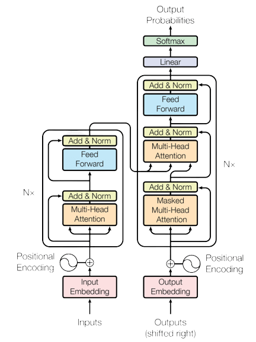

## Transformer Machine Translation from scratch using PyTorch

 The Transformer architecture was presented in the 2017 paper "Attention is All You Need" and up to this day has been revolutionizing how we can leverage AI to solve real problems in an acceptable performance. One of these tasks is machine translation, which is basically translate a text from one language to another. Several algorithms and architectures were created to output translation in a human level, and a big breaktrhough on the translation task was generated by the Transformer, enabling machines to translate text in a nearly perfection basis.

 Building a Transformer from scratch requires two connected blocks: the encoder and the decoder. An encoder will deeply understand the meaning of the original text and associate weights to it, then pass its output to the decoder, which will generate text based on the inputs recieved by the two modules.

Although this is a model built from scratch, some parts are not the main focus of the article, therefore some level of help will be used by built-in modules from PyTorch. Since the main focus is what makes Transformers so good at text generation, the essencial parts that makes this possible will be built as raw as possible. 

#### Encoder
 
 The basic layer of a Transformer is a Self-Attention, which is composed of several computations such as matrix multiplications, that calculates the weights that the model will ajust in order to improve its translation. A self-attention step is generated by three basic variables: the queries, keysand values. Each of these values have a weight W_d associated with them, calculated using the model dimension defined by d_model. For each value, a matrix multiplication between the query and key is performed, normalizing the values and calculating the softmax of the result, and then multipliyng by the matrix v. This calculation will generate a matrix T x T, which gives the attention each token pays to the other. We also perform this calculation four times, one for each head as specified in the paper, calling this operation Multi-Head Attention.

 

Another import part of the self-attention is the **mask for padding**. When the text is tokenized by a pretrained **tokenizer**, a special token is used for any padding between the samples. Padding is performed because not every text input has the same length, but the model has to be provided with a matrix that has a fixed dimensionality. The padding mask will hide these tokens that are not relevant for the model, placing a zero in them, while the relevant ones are ones.

As presented in the first image, the first step in the Transformer is an Embedding layer, followed by a addition called positional encoding. This step is important because attention layers don't take into account the exact position of the word in a sentence, given that all the tokens in the self-attention layer are passed in parallel to generate the the attention weights.

For finishing up the encoder block, two normalizations layers are inserted, along with a **feed forward linear layer** and a dropout for regularization. It's important to note that the output generated by the final layer of the enocder will be used as a input on the second Multi-Head Attention layer of the decoder, more specifically, as the key and value inputs of the decoder layer.

The encoder block is repeated 6 times in the original paper, but this number is set to be a hyperparameter of the Transformer model.

#### Decoder

The following block of the Encoder uses almost the same architecture as its predecessor, with some few but important changes that are going to be addressed. 

The first one is a second mask added to the first multi-head attention layer of the decoder, which is called the **causal mask**. This mask is necessary because attention layers pass all the sentence tokens as a response in the training, and since the objective of a decoder is to predict the next token, recieving all the tokens at once would invalidate the training process. The solution comes in form of a triangular mask matrix that hides future tokens from the decoder at given timestep. Since the decoder input for training is just the translated sentence shifted right, this mask will hide tokens that the model has not seen yet, starting with a CLS token (the timestep that the mask hides the entire sentence) and forward.

After a skip and normalization layer, there is another multi-head Attention layer, but this one doens't have the causal mask hidding part of the sentence. In this layer, the query value is input from the output of the previous layers of the decoder, while the key and value come from the encoder output. This joint of inputs creates a powerfull understanding of the text by the model, because it recieves an output by the encoder that contains a semantic understanding of the text along with a output generated by the desired reponse sequence by the first encoder layers.

After another normalization and feed forward layers, the final output goes throught a final softmax layer, that will classify the output as one of the vocabulary words, meaning that the final layer will have an output with the size of the tokenizer's vocabulary.

#### Training

The training is performed by loading data with a PyTorch data loader, and performing backward and step using a cross entropy loss function and an Adam optimizer for bacthes in the dataset for a chosen number of epochs. As said, the Transformer model consists of an encoder and a decoder, using the output of the encoder as an input of the decoder. That means that there are two variables to be passed to the model, and one to the loss function. To the model is provided the text input, the one that are going to be translated, as well as the decoder input, which is the translated text shifted right. Not to be forgotten is the padding masks, that must be created for the encoder and decoder, mirroring the same size of the respective input id (tokens) matrix. The loss function recieves the original text along with the outputs of the decoder. The rest of the training follows a simple PyTorch training loop.

##### E-mail: flavioploss@hotmail.com
##### [LinkedIn](https://www.linkedin.com/in/flavio-loss-b398a5181/)
